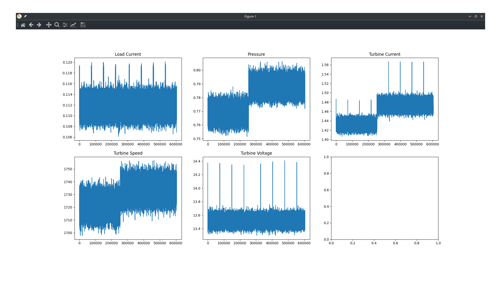
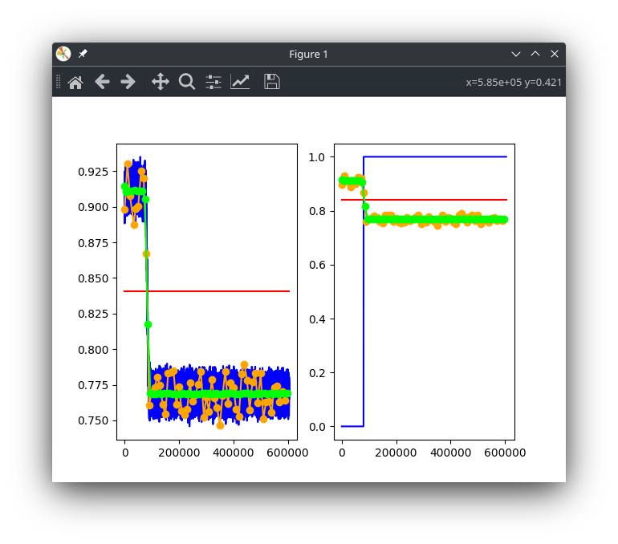

# ***Solution***

We were given the task to detect potential water leakage before it occurs, with the help of pre-prepared data. Faster and more efficient detection of potential water discharges can drastically help reduce drinking water losses in the environment. We were faced with the challenge of developing an algorithm that will try to automatically detect water spills. The task was divided into two phases which we will explain below. 

## **Phase 1**

In the first phase, the focus was on **analyzing the given data** and trying to **detect water discharges** based on unlabeled data from micro-turbine signals.   
The only supported programming language was Python, so first we had to import data from a .csv file into a data structure which we then used for our analysis.
 
After converting the data, we wrote a python program which converted data sets into graph form. We plotted 5 graphs on the basis of given data for load current, pressure, turbine current, turbine speed and turbine voltage.   

 
 We have come to the conclusion that the most reliable change is the data for the pressure and we upgraded it by finding those points where data are the most odd and connecting them. 
For the sake of better clarity, we upgraded our graph again by marking even more relevant points.  

  
After writing the code, we converted it into a json file, containing information about when the leakages occurred, and uploaded it as required.  

## **Phase 2**
The second phase had a more advance dataset than the first one. 
 
Similar to what we did in the first phase, we opted to implement the prediction algorithm by trying to understand the data and the relations between different parameters beforehand.
We came up with a simple, but seemingly a somewhat effective solution. Making use of the provided training data, we calculated the average pressure values of measurements during leakage and during normal operation respectively. For each measured value  
Beside the resulting json file, we also submitted the working algorithm, which is able to predict real time stream data.git